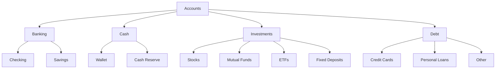

# Future Features — Personal Finance System

## Overview

The **Personal Finance System** is designed to transform Apple Numbers into a structured, private, and flexible financial management platform.

The system will provide core capabilities for:

- Account management
- Transaction tracking
- Budget management
- Bills and recurring payments
- Net worth tracking
- Cashflow analysis
- Spending analytics
- Investment tracking
- Debt management
- Financial reporting
- Multi-device synchronization

The system will primarily use **Apple Numbers tables, formulas, Pop-Up Menus, checkboxes, conditional formatting, charts, and iCloud synchronization**.

---

# 1. Accounts Management

## Objective

Provide a centralized system for managing all financial accounts and tracking their current balances.

## Accounts Table

| Field            | Description                                |
| ---------------- | ------------------------------------------ |
| Account ID       | Unique identifier                          |
| Account Group    | Banking, Cash, Investments, Debt           |
| Account Subgroup | Savings, Checking, Credit Card, Loan, etc. |
| Account Name     | Name of the account                        |
| Account Type     | Bank, Cash, Credit, Investment, Loan       |
| Currency         | Account currency                           |
| Opening Balance  | Initial balance                            |
| Current Balance  | Current account balance                    |
| Status           | Active / Inactive                          |
| Notes            | Additional information                     |

## Account Groups

Recommended groups:



## Core Requirements

- Create accounts
- Edit accounts
- Deactivate accounts
- Track account balances
- Group accounts
- Track account currency
- Calculate account totals
- Separate assets and liabilities

## Account Balance

The current balance should be derived from:

```text
Opening Balance + Transaction Activity = Current Balance
```

---

# 2. Transactions Management

## Objective

Create a centralized transaction ledger containing every income, expense, transfer, and financial activity.

## Transactions Table

| Field            | Description                 |
| ---------------- | --------------------------- |
| Transaction ID   | Unique identifier           |
| Date             | Transaction date            |
| Account          | Associated account          |
| Category         | Transaction category        |
| Payee            | Merchant/person             |
| Amount           | Signed transaction amount   |
| Transaction Type | Income / Expense / Transfer |
| Notes            | Additional details          |
| Tags             | Custom labels               |
| Reference        | Optional reference number   |

## Amount Convention

Use signed values:

```text
Income    → Positive
Expense   → Negative
Transfer  → Depends on account direction
```

Example:

```text
Salary       +₹50,000
Groceries    -₹3,000
Electricity  -₹1,500
Freelancing  +₹10,000
```

## Data Entry

Use Numbers **Pop-Up Menu** fields for:

- Account
- Category
- Transaction Type
- Tags where appropriate

## Core Requirements

- Add transactions
- Edit transactions
- Delete transactions
- Filter transactions
- Sort by date
- Search by payee
- Filter by account
- Filter by category
- Filter by tags
- Calculate account balances

---

# 3. Categories & Tagging

## Objective

Create a consistent classification system for income and expenses.

## Categories Table

| Category      | Type    | Budget Group   | Active |
| ------------- | ------- | -------------- | ------ |
| Salary        | Income  | Income         | Yes    |
| Freelancing   | Income  | Income         | Yes    |
| Groceries     | Expense | Food           | Yes    |
| Transport     | Expense | Transportation | Yes    |
| Rent          | Expense | Housing        | Yes    |
| Entertainment | Expense | Lifestyle      | Yes    |

## Category Types

```text
Income
Expense
Transfer
Investment
Debt
```

## Tagging

Tags provide additional classification without creating excessive categories.

Examples:

```text
#Work
#Personal
#Travel
#Education
#Health
#Subscription
#Project
```

## Benefits

Categories answer:

> "What did I spend money on?"

Tags answer:

> "Why or in what context did I spend it?"

---

# 4. Budget Management

## Objective

Track planned spending against actual spending.

## Budget Table

| Category      | Budget | Actual | Difference | % Used |
| ------------- | -----: | -----: | ---------: | -----: |
| Food          | ₹5,000 | ₹4,200 |       ₹800 |    84% |
| Transport     | ₹3,000 | ₹2,100 |       ₹900 |    70% |
| Entertainment | ₹2,000 | ₹2,300 |      -₹300 |   115% |

## Calculations

### Difference

```text
Budget − Actual
```

### Budget Utilization

```text
Actual / Budget × 100
```

## Budget Periods

Support:

- Monthly
- Quarterly
- Yearly

## Budget Tracking

Use `SUMIFS()` to calculate actual spending based on:

- Category
- Date range
- Account
- Budget period

## Budget Status

```text
< 75%     → Safe
75–100%   → Warning
> 100%    → Exceeded
```

---

# 5. Bills & Recurring Transactions

## Objective

Track recurring financial obligations and prevent missed payments.

## Recurring Table

| Bill      |  Amount | Frequency | Due Day | Account | Next Due   | Paid |
| --------- | ------: | --------- | ------: | ------- | ---------- | ---- |
| Rent      | ₹10,000 | Monthly   |       5 | HDFC    | 05/09/2026 | ☑    |
| Internet  |    ₹799 | Monthly   |      15 | SBI     | 15/09/2026 | ☐    |
| Insurance | ₹12,000 | Yearly    |      20 | SBI     | 20/08/2027 | ☐    |

## Supported Frequencies

- Weekly
- Monthly
- Quarterly
- Half-yearly
- Yearly

## Features

- Due date tracking
- Payment status
- Recurring amount
- Frequency
- Account association
- Next due date
- Notes

## Automatic Date Calculation

Use `EDATE()` for monthly/yearly recurring payments.

```text
Next Due Date = EDATE(Current Due Date, Months)
```

## Upcoming Bills

Sort by:

```text
Next Due Date → Ascending
```

This creates a simple financial calendar/forecast.

---

# 6. Net Worth Tracking

## Objective

Track financial wealth over time.

## Formula

```text
Net Worth = Total Assets − Total Liabilities
```

## Assets

Examples:

- Bank balances
- Cash
- Stocks
- Mutual funds
- ETFs
- Fixed deposits

## Liabilities

Examples:

- Credit cards
- Personal loans
- Other debts

## Net Worth History

| Month    |   Assets | Liabilities | Net Worth |
| -------- | -------: | ----------: | --------: |
| January  | ₹100,000 |     ₹20,000 |   ₹80,000 |
| February | ₹115,000 |     ₹18,000 |   ₹97,000 |
| March    | ₹130,000 |     ₹15,000 |  ₹115,000 |

## Visualization

Use a **Line Chart** to show net worth growth.

---

# 7. Cashflow Tracking

## Objective

Understand how money enters and leaves the financial system.

## Formula

```text
Net Cashflow = Total Income − Total Expenses
```

## Monthly Cashflow

| Month    |  Income | Expenses | Net Cashflow |
| -------- | ------: | -------: | -----------: |
| January  | ₹50,000 |  ₹35,000 |      ₹15,000 |
| February | ₹55,000 |  ₹37,000 |      ₹18,000 |
| March    | ₹50,000 |  ₹40,000 |      ₹10,000 |

## Key Metrics

- Total income
- Total expenses
- Net cashflow
- Savings
- Savings rate

## Visualization

Use:

- Line chart
- Column chart
- Monthly comparison

---

# 8. Spending Analysis

## Objective

Understand where money is being spent and identify spending patterns.

## Category Analysis

| Category      | Monthly Spending |
| ------------- | ---------------: |
| Food          |           ₹4,200 |
| Transport     |           ₹2,100 |
| Housing       |          ₹10,000 |
| Entertainment |           ₹1,500 |

## Analysis Dimensions

Analyze spending by:

- Category
- Month
- Account
- Payee
- Tag
- Budget group

## Top Spending Categories

Identify categories with the highest expenses.

## Visualization

Use:

- Bar charts
- Column charts
- Pie charts
- Monthly trend charts

## Monthly Comparison

Compare:

```text
Current Month
       vs
Previous Month
```

Example:

```text
Food
July     ₹4,500
August   ₹4,200
Change   -₹300
```

---

# 9. Profit & Loss Reporting

## Objective

Provide a simplified income statement for financial activities such as freelancing, contracting, or side businesses.

## Formula

```text
Total Income
− Total Expenses
= Net Profit
```

## P&L Table

| Category       |  Amount |
| -------------- | ------: |
| Revenue        | ₹60,000 |
| Software       | -₹3,000 |
| Marketing      | -₹2,000 |
| Other Expenses | -₹5,000 |
| Net Profit     | ₹50,000 |

## Metrics

- Revenue
- Operating expenses
- Net profit
- Profit margin

## Profit Margin

```text
Net Profit / Revenue × 100
```

---

# 10. Financial Dashboard

## Objective

Create a single-page overview of the user's financial situation.

## Dashboard Metrics

### Primary Metrics

```text
Net Worth
Total Assets
Total Liabilities
Monthly Income
Monthly Expenses
Net Cashflow
Savings Rate
```

## Dashboard Components

### Net Worth

Display current net worth prominently.

### Cashflow

Show:

```text
Income
Expenses
Net Cashflow
```

### Budget

Show:

```text
Budget Used
Remaining Budget
Exceeded Categories
```

### Bills

Show:

```text
Upcoming Bills
Overdue Bills
Bills Due This Week
```

### Spending

Display:

- Top categories
- Largest transactions
- Monthly spending trend

## Dashboard Principle

The Dashboard should answer:

> **"What is the current state of my finances?"**

within a few seconds.

---

# 11. CSV / OFX / QIF Import

## Objective

Allow external financial data to be imported into the system.

## CSV Workflow

```text
Bank
 ↓
Export CSV
 ↓
Open in Numbers
 ↓
Map Columns
 ↓
Clean Data
 ↓
Transactions Table
```

## CSV Mapping

Typical bank fields:

```text
Bank Date
Transaction Description
Debit
Credit
Balance
```

Map them into:

```text
Date
Payee
Amount
Account
Category
Notes
```

## Data Validation

Before importing:

- Verify dates
- Verify amounts
- Remove duplicates
- Check missing values
- Normalize payee names
- Assign categories

## OFX / QIF

Support can be provided through compatible conversion workflows when direct Numbers import is unavailable.

## Limitation

This system does not provide automatic bank synchronization.

---

# 12. Multi-Device & iCloud Sync

## Objective

Make the financial workbook available across Apple devices.

## Supported Devices

- Mac
- iPhone
- iPad

## Architecture

```text
             iCloud
                │
        ┌───────┼───────┐
        ↓       ↓       ↓
      Mac     iPhone   iPad
```

## Benefits

- Automatic synchronization
- Cross-device access
- Apple ecosystem integration
- Private storage workflow
- No dedicated finance-server dependency

## Recommended Workflow

Use the Mac for:

- Setup
- Bulk transaction entry
- Reports
- Formula management

Use iPhone/iPad for:

- Quick transaction entry
- Balance checking
- Dashboard viewing
- Bill checking

---

# 13. Custom Fields

## Objective

Allow the system to adapt to individual financial requirements.

Numbers supports adding additional columns to tables as required.

## Potential Fields

```text
Project
Payment Method
Merchant
Location
Reference ID
Tax Deductible
Reimbursement
Subscription
Notes
Attachment Reference
```

## Example

| Date       | Category |  Amount | Project    | Reimbursable |
| ---------- | -------- | ------: | ---------- | ------------ |
| 10/08/2026 | Software | -₹2,000 | AI Project | Yes          |

## Benefits

Custom fields allow the system to support:

- Personal finance
- Freelancing
- Business expenses
- Project expenses
- Reimbursements

---

# 14. Multi-Level Account Classification

## Objective

Provide a structured hierarchy for financial accounts.

## Hierarchy

```text
Account Group
    ↓
Account Subgroup
    ↓
Account Name
```

## Example

```text
Banking
├── Checking
│   └── HDFC Checking
│
└── Savings
    └── SBI Savings

Investments
├── Stocks
│   └── Equity Portfolio
│
└── Mutual Funds
    └── Index Fund

Debt
├── Credit Card
│   └── HDFC Credit Card
│
└── Loan
    └── Personal Loan
```

## Advantages

- Better organization
- Easier reporting
- Flexible account expansion
- Clear asset/liability grouping

---

# 15. Monthly Financial Reports

## Objective

Generate a standardized monthly financial summary.

## Monthly Report Structure

```text
MONTHLY FINANCIAL REPORT
│
├── Income
├── Expenses
├── Net Cashflow
├── Savings Rate
├── Net Worth
├── Budget Performance
├── Top Spending Categories
├── Investments
├── Debt
└── Upcoming Bills
```

## Monthly Summary

| Metric    | Current Month | Previous Month |   Change |
| --------- | ------------: | -------------: | -------: |
| Income    |       ₹50,000 |        ₹48,000 |  +₹2,000 |
| Expenses  |       ₹35,000 |        ₹36,000 |  -₹1,000 |
| Cashflow  |       ₹15,000 |        ₹12,000 |  +₹3,000 |
| Net Worth |      ₹115,000 |       ₹100,000 | +₹15,000 |

## Key Questions

The report should answer:

- How much did I earn?
- How much did I spend?
- Where did I spend it?
- How much did I save?
- Did I stay within budget?
- Did my net worth increase?
- Did my debt decrease?

---

# 16. Budget Alerts & Conditional Formatting

## Objective

Provide immediate visual feedback when spending approaches or exceeds a budget.

## Budget Status

```text
0–74%       → Safe
75–99%      → Warning
100%+       → Exceeded
```

## Conditional Formatting

Apply formatting to `% Used`.

Example:

```text
Food          65%   🟢
Transport     82%   🟡
Entertainment 115%  🔴
```

## Alert Categories

### Safe

Budget usage is within the planned range.

### Warning

Spending is approaching the budget limit.

### Exceeded

Actual spending has exceeded the allocated budget.

## Future Enhancement

Potentially create an **Alerts** section on the Dashboard showing:

```text
⚠ Food budget 90% used
⚠ Electricity bill due in 2 days
🔴 Entertainment budget exceeded
```

---

# 17. Savings Rate Tracking

## Objective

Measure how effectively income is being converted into savings.

## Formula

```text
Savings = Income − Expenses
```

```text
Savings Rate =
Savings / Income × 100
```

## Example

```text
Income      = ₹50,000
Expenses    = ₹35,000
Savings     = ₹15,000

Savings Rate = 30%
```

## Monthly Tracking

| Month    |  Income | Expenses | Savings | Savings Rate |
| -------- | ------: | -------: | ------: | -----------: |
| January  | ₹50,000 |  ₹35,000 | ₹15,000 |          30% |
| February | ₹55,000 |  ₹37,000 | ₹18,000 |        32.7% |
| March    | ₹50,000 |  ₹40,000 | ₹10,000 |          20% |

## Visualization

Use a line chart to track savings-rate trends.

---

# 18. Investment & Asset Tracking

## Objective

Track investments and financial assets separately from ordinary bank balances.

## Investment Table

| Asset      | Type        | Quantity | Purchase Value | Current Value | Gain/Loss |
| ---------- | ----------- | -------: | -------------: | ------------: | --------: |
| Index Fund | Mutual Fund |      100 |        ₹20,000 |       ₹23,000 |    ₹3,000 |
| Stock A    | Stock       |       20 |        ₹10,000 |       ₹12,000 |    ₹2,000 |

## Asset Types

- Stocks
- Mutual funds
- ETFs
- Fixed deposits
- Bonds
- Other investments

## Gain/Loss

```text
Gain/Loss =
Current Value − Purchase Value
```

## Return

```text
Return % =
Gain/Loss / Purchase Value × 100
```

## Portfolio Metrics

Track:

- Total invested
- Current value
- Total gain/loss
- Return percentage
- Asset allocation

---

# 19. Debt & Liability Tracking

## Objective

Track outstanding debt and monitor repayment progress.

## Debt Table

| Debt          | Type   | Original Amount | Outstanding | Interest Rate | Due Date |
| ------------- | ------ | --------------: | ----------: | ------------: | -------- |
| Personal Loan | Loan   |        ₹100,000 |     ₹60,000 |           10% | 5th      |
| Credit Card   | Credit |         ₹20,000 |      ₹8,000 |             — | 15th     |

## Key Metrics

- Total debt
- Outstanding balance
- Monthly payment
- Interest rate
- Debt reduction
- Debt-to-asset ratio

## Debt Reduction

Track:

```text
Opening Debt − Current Debt
```

## Debt-to-Asset Ratio

```text
Total Liabilities / Total Assets × 100
```

A decreasing ratio generally indicates improving balance-sheet strength.

---

# 20. Financial Analytics & Trends

## Objective

Provide historical analysis that helps identify financial patterns and improve decision-making.

## Month-over-Month Analysis

Compare:

```text
Current Month
vs
Previous Month
```

Track changes in:

- Income
- Expenses
- Savings
- Net worth
- Debt
- Investments

## Year-over-Year Analysis

Compare the same month across different years.

Example:

```text
August 2025 Expenses → ₹30,000
August 2026 Expenses → ₹35,000

Change → +₹5,000
```

## Rolling Averages

Calculate:

- 3-month average
- 6-month average
- 12-month average

Example:

```text
3-Month Average Spending =
(June + July + August) / 3
```

## Spending Trends

Identify:

- Increasing expenses
- Decreasing expenses
- Recurring high expenses
- Unusual spending
- Categories exceeding historical averages

## Net Worth Trend

Track:

```text
Monthly Net Worth
        ↓
Historical Growth
        ↓
Long-Term Financial Progress
```

## Investment Trends

Analyze:

- Portfolio growth
- Asset allocation
- Investment returns
- Monthly contributions

## Debt Trends

Analyze:

- Outstanding debt
- Debt reduction
- Repayment progress
- Interest burden

---

# Recommended Workbook Structure

The complete Numbers workbook should contain the following sheets:

```text
Personal Finance.numbers
│
├── Dashboard
│
├── Accounts
│
├── Transactions
│
├── Categories
│
├── Budget
│
├── Recurring
│
├── Net Worth
│
├── Cashflow
│
├── Spending Analysis
│
├── P&L
│
├── Investments
│
├── Debts
│
├── Monthly Reports
│
├── Financial Analytics
│
└── Settings
```

---

# Core Formula Architecture

The system should rely primarily on a small set of Numbers functions.

```text
SUM()
SUMIF()
SUMIFS()
COUNTIF()
COUNTIFS()
IF()
IFS()
AND()
OR()
EDATE()
```

## Data Flow

```text
                    TRANSACTIONS
                         │
          ┌──────────────┼──────────────┐
          ↓              ↓              ↓
       ACCOUNTS       CATEGORIES       TAGS
          │              │              │
          └──────────────┼──────────────┘
                         ↓
                    CALCULATIONS
                         │
       ┌─────────────────┼─────────────────┐
       ↓                 ↓                 ↓
    BUDGETS          CASHFLOW          NET WORTH
       │                 │                 │
       └─────────────────┼─────────────────┘
                         ↓
                    ANALYTICS
                         │
       ┌─────────────────┼─────────────────┐
       ↓                 ↓                 ↓
    REPORTS          DASHBOARD          TRENDS
```

---

# Implementation Priority

The features should be implemented in stages rather than simultaneously.

## Phase 1 — Core Foundation

1. Accounts Management
2. Transactions Management
3. Categories & Tagging
4. Multi-Level Account Classification

## Phase 2 — Financial Management

5. Budget Management
6. Bills & Recurring Transactions
7. Net Worth Tracking
8. Cashflow Tracking

## Phase 3 — Reporting

9. Spending Analysis
10. Profit & Loss Reporting
11. Financial Dashboard
12. Monthly Financial Reports

## Phase 4 — Data & Synchronization

13. CSV / OFX / QIF Import
14. Multi-Device & iCloud Sync
15. Custom Fields

## Phase 5 — Advanced Finance

16. Budget Alerts & Conditional Formatting
17. Savings Rate Tracking
18. Investment & Asset Tracking
19. Debt & Liability Tracking
20. Financial Analytics & Trends

---

# Long-Term Goal

The final system should function as a **private personal finance operating system inside Apple Numbers**.

```text
                       PERSONAL FINANCE
                              │
             ┌────────────────┼────────────────┐
             ↓                ↓                ↓
          ACCOUNTS       TRANSACTIONS       BUDGETS
             │                │                │
             ↓                ↓                ↓
        NET WORTH         CATEGORIES         BILLS
             │                │                │
             └────────────────┼────────────────┘
                              ↓
                         CASHFLOW
                              │
             ┌────────────────┼────────────────┐
             ↓                ↓                ↓
        INVESTMENTS          DEBT           SAVINGS
             │                │                │
             └────────────────┼────────────────┘
                              ↓
                         ANALYTICS
                              │
             ┌────────────────┼────────────────┐
             ↓                ↓                ↓
          REPORTS         DASHBOARD          TRENDS
                              │
                              ↓
                    FINANCIAL OVERVIEW
```

The implementation should follow a **data-first architecture**: establish clean account and transaction data first, build reliable formulas second, and add dashboards, reporting, and advanced analytics only after the underlying calculations are validated.
